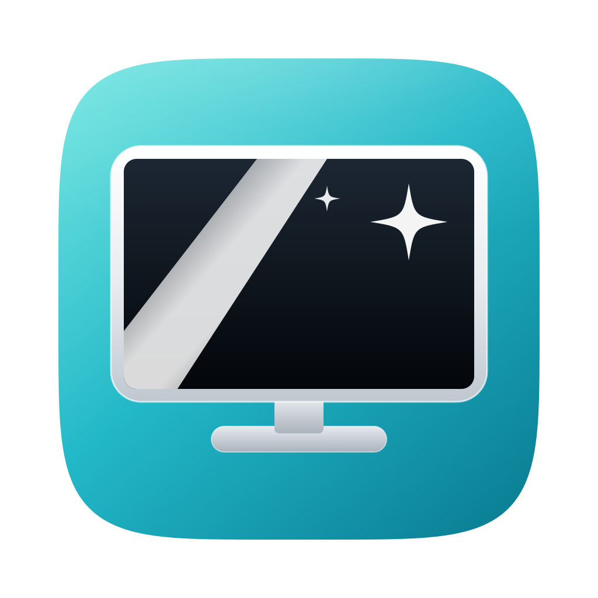
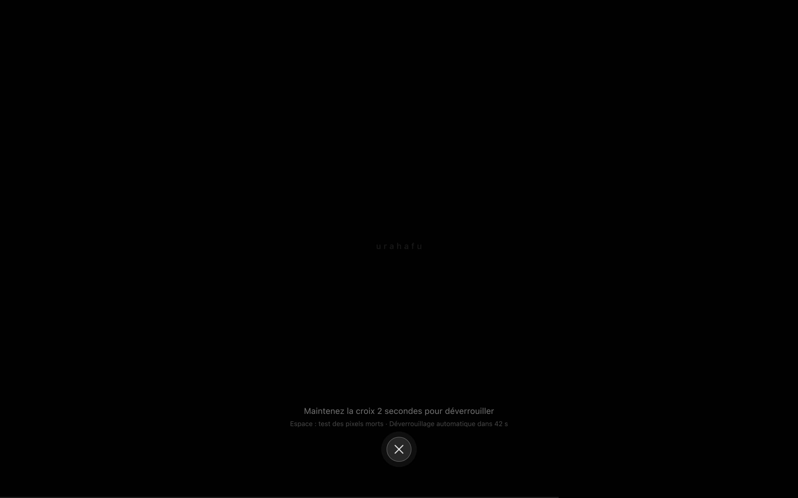

# Urahafu



**Urahafu** ("the cleanliness" in Shimaore, the language of Mayotte) is an
open-source macOS utility, written in Rust, that lets you clean your screen and keyboard without triggering
stray clicks or keystrokes. It fills the screen with a solid color and blocks
the keyboard, clicks, trackpad and media keys while you wipe — you unlock by
pressing and holding the ✕ button for 2 seconds.



## Features

- **Unlock by holding the ✕ button for 2 seconds** — a progress ring fills
  around the button as you hold it; releasing early or moving off it cancels
  and drains the ring. Works with any keyboard layout, since it doesn't
  involve typing at all — key events aren't even read for their character
  anymore, only used to know that *some* key was pressed (see
  [Privacy & security](#privacy--security)).
- **3-second countdown** before blocking starts, cancellable with Esc or a
  click.
- **Fail-safe auto-unlock** after 30, 60 or 90 seconds (default 60s), so you
  can never get truly stuck even without touching the ✕ button.
- **Keyboard-only mode**: blocks input without hiding the screen, showing a
  small HUD instead of a full-screen overlay.
- **Dead-pixel test**: press Space during a session to cycle red → green →
  blue → white → black, to spot dead or stuck pixels while you're at it.
- **Black or white cleaning screen**, whichever shows dust or smudges best.
- **Menu bar mode or direct-launch mode**: keep the usual menu bar icon and
  menu, or hide the icon so opening the app cleans immediately — hold
  <kbd>Option</kbd> at launch to get the menu back for that one launch.
- **Open at login**, as a standard macOS login item.
- **47 languages** (see the full list in
  [`docs/TRANSLATIONS.md`](docs/TRANSLATIONS.md#languages)), following the system language
  automatically.

## Translations

Every user-visible string is translated from `translations/*.xlf` (XLIFF 1.2, one file per
language) — see [`docs/TRANSLATIONS.md`](docs/TRANSLATIONS.md) for the file format, how to add a
language (no Rust involved) and how to use Poedit/Weblate/Crowdin with these files. macOS also lets
you pick Urahafu's language independently of your system language: **System Settings › General ›
Language & Region › Applications**.

## Installation

Urahafu isn't notarized or distributed through the App Store; it ships as a
zip from GitHub Releases.

1. Download the latest `Urahafu-<version>.zip` and its matching
   `Urahafu-<version>.zip.sha256` from the
   [Releases page](../../releases).
2. Verify the checksum (optional but recommended):
   ```sh
   shasum -a 256 -c Urahafu-<version>.zip.sha256
   ```
3. Unzip it and move `Urahafu.app` to `/Applications`.

### Gatekeeper: opening an unsigned app

Urahafu is signed ad-hoc (see [Privacy & security](#privacy--security)), not
with a paid Apple Developer certificate, so Gatekeeper will refuse to open it
with a plain double-click the first time. This is expected for an
open-source project without an Apple Developer account, not a sign that
something's wrong. Pick one:

- **Right-click (or Control-click) `Urahafu.app` → Open**, then confirm in the
  dialog that appears. This is the standard, safest way to open an
  ad-hoc-signed app once.
- Or go to **System Settings › Privacy & Security**, scroll down, and click
  **"Open Anyway"** next to the message about Urahafu.
- Or, from Terminal, clear the quarantine attribute macOS attaches to files
  downloaded from the internet:
  ```sh
  xattr -dr com.apple.quarantine /Applications/Urahafu.app
  ```
  Being fully honest about what this does: it removes the flag that makes
  Gatekeeper prompt in the first place, for this app only. It doesn't verify
  anything about the binary beyond what your own review or the checksum
  above already gives you — use it if you're comfortable with that, not as a
  way to skip understanding the previous two options.

### Granting Accessibility permission

Urahafu asks for Accessibility access on first launch. It needs this because
blocking keyboard and trackpad input while you clean requires a macOS
accessibility event tap (`CGEventTap`) — there's no other public API for it.
Nothing you type is recorded, logged, or sent anywhere: see
[Privacy & security](#privacy--security) below, and the alert itself says so
before you grant anything.

Grant it in **System Settings › Privacy & Security › Accessibility**, or by
clicking "Open System Settings" in Urahafu's own prompt.

## How it works

The input-blocking event tap only exists while a cleaning session is active:
it's installed right before the countdown ends and removed the moment the
session ends (unlock, fail-safe, crash, or force-quit). Urahafu refuses to
start cleaning at all if it can't guarantee the tap will work — missing
permission, an active Secure Input field elsewhere on the system, or a tap
that fails to install — because a utility that blocks input is only safe if
it can also reliably stop blocking it.

As a safety net beyond the fail-safe timer: a watchdog thread independent of
the main thread disables the tap at the fail-safe deadline plus a small
margin, and a panic hook releases input immediately if the app panics. Killing
the process outright (`kill -9`) also returns input to normal, since macOS
tears down the event tap when the owning process dies.

## Privacy & security

- **No network access at all.** Urahafu doesn't make any network requests,
  ever.
- **No keystroke logging, and no keystroke reading either.** Unlocking works
  by holding an on-screen ✕ button, not by typing, so the app doesn't need to
  know which key was pressed at all — key events forwarded internally no
  longer carry the character, only the fact that a key (or Space, or Escape)
  was blocked. This is stronger than just not storing what you type: there's
  nothing left to store.
- **Settings** are stored locally in
  `~/Library/Application Support/Urahafu/settings.conf` (cleaning color,
  fail-safe delay, keyboard-only mode, menu bar icon visibility).
- **Login item** state is just the presence of a LaunchAgent plist at
  `~/Library/LaunchAgents/` — no separate flag is stored for it.

See [SECURITY.md](SECURITY.md) for the full threat model and how to report a
vulnerability.

## Building from source

Requires a recent stable Rust toolchain (edition 2024; see the MSRV job in
CI for the minimum supported version) and Xcode command line tools.

```sh
cargo build --release
cargo install --locked cargo-bundle   # once
cargo bundle --release
```

`cargo bundle` produces `target/release/bundle/osx/Urahafu.app`.

## Development

```sh
cargo install --locked cargo-audit cargo-deny   # once
cargo fmt --all
cargo clippy --all-targets -- -D warnings
cargo test
cargo audit
cargo deny check
```

CI (`.github/workflows/ci.yml`) runs all of the above on every push and pull
request, plus `cargo doc` with warnings denied and an MSRV check. See
[CONTRIBUTING.md](CONTRIBUTING.md) for code conventions (no `unwrap()` in
production code, `unsafe` confined to `src/platform/ffi/`, every
user-facing string through `core::i18n::Text`).

## Dependencies

| Crate | Why |
|---|---|
| `thiserror` | Ergonomic, typed error enums for `crate::error::Error`. |
| `winit` | Cross-platform windowing, used here for one borderless window per monitor (or the keyboard-only HUD). |
| `softbuffer` | Software pixel buffer presentation into `winit` windows — no GPU/Metal dependency needed for solid-color fills and simple shapes. |
| `tray-icon` | Menu bar icon and menu in menu bar mode. |
| `core-foundation` | Safe(r) wrappers around the CoreFoundation types the macOS FFI layer needs (CFRunLoop, CFString, CFLocale). |
| `core-graphics` | Bindings for `CGEventTap` and related APIs, the core of the input blocker. |
| `core-text` | Renders the system font via CoreText at runtime, so no font file is embedded or read from disk (see `design/DESIGN.md` §1 and §5 for why). |
| `objc2` / `objc2-foundation` / `objc2-app-kit` | Native `NSAlert` presentation for first-launch, error and about dialogs — drawn by AppKit with system resources, not custom UI. |

Build-time only (never linked into the shipped binary):

| Crate | Why |
|---|---|
| `roxmltree` | Parses `translations/*.xlf` in `build.rs` to generate the `Text`/`Language` API — see `docs/TRANSLATIONS.md`. |

No `serde` and no image-decoding crate: settings use a hand-rolled
`key = value` format, and the menu bar icon is embedded as raw RGBA generated
by `design/scripts/export-icons.sh`, not decoded at runtime.

## Project layout

See [`docs/ARCHITECTURE.md`](docs/ARCHITECTURE.md) for the full module
layout and the contract between `src/core/` (pure, cross-platform, unit
tested) and `src/platform/` (macOS-only, where all `unsafe` code lives). For
manual, macOS-specific test coverage (permissions, event taps, hardware
keys), see [`docs/MANUAL_TESTING.md`](docs/MANUAL_TESTING.md).

## Compatibility

macOS 11 Big Sur or later. Actively tested on recent macOS versions.

## License

MIT — see [LICENSE](LICENSE).
