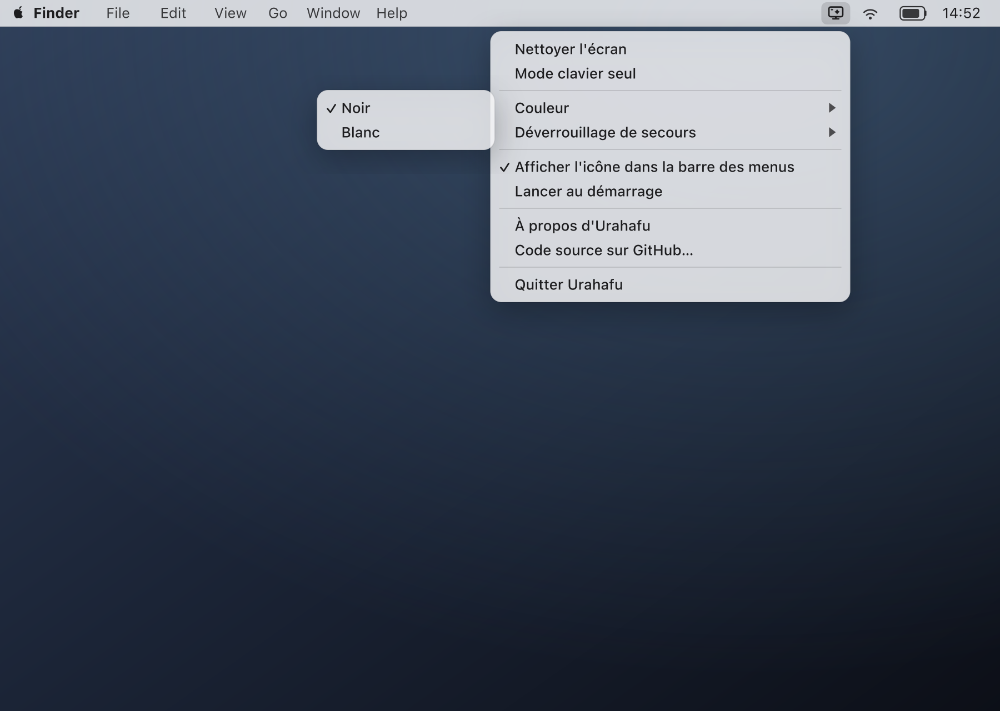
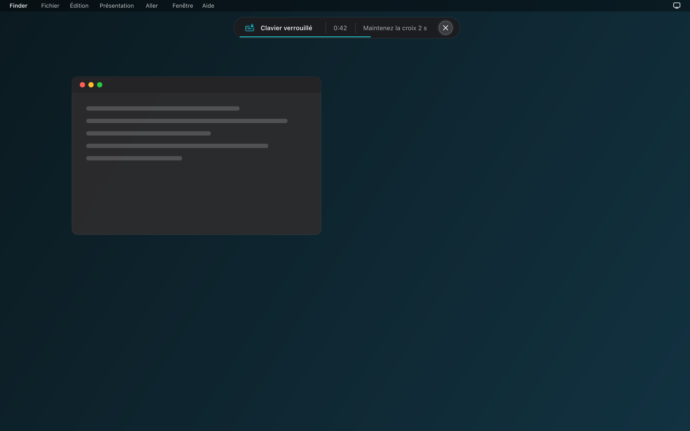

# Urahafu — Design

Urahafu — "Urahafu" means "the cleanliness" in Shimaore, the language of Mayotte — is an
open-source macOS utility, written in Rust, that lets you clean your screen and keyboard without
triggering stray clicks or keystrokes: it fills the screen with a solid color and blocks keyboard,
clicks, trackpad and media keys while you wipe. Unlock by pressing and holding an on-screen ✕
button for 2 seconds.

This document collects the design decisions (visual, textual, behavioral) and their rationale. The
source of truth for detailed behavior is the mockups in `design/mockups/`.

## 1. Principles

- **Safety first: the user never gets stuck.** Automatic fail-safe unlock (30/60/90 s),
  cancellable during the countdown, and above all: if keyboard blocking can't be guaranteed
  (permission denied, a failing event tap, Secure Input active), **cleaning does not start**.
  Better not to clean than to clean without being able to unlock.
  Why: a utility that blocks input is inherently dangerous if it fails halfway; the only
  defensible position is to refuse to start rather than risk a real lockout.

- **Discretion.** No Dock icon in menu bar mode, no notifications, no network access, nothing
  recorded or transmitted about what's typed. Unlocking by holding the ✕ button pushes this
  further than before: the app no longer even needs to know which key was pressed — key events
  forwarded internally no longer carry the typed character at all.
  Why: this is a tool used in public or in meetings; it must neither draw attention nor raise
  suspicion about what it does with keystrokes.

- **No embedded Apple resources.** No SF Symbols: every icon (menu bar, app, internal glyphs) is
  drawn for Urahafu. No font file is embedded or read from disk: the overlay's text uses the
  system font, rendered at runtime via the public CoreText API (see §5).
  Why: SF Symbols is under a non-free Apple license, and embedding it would commit the project to
  decisions and updates Apple doesn't guarantee over time — incompatible with a long-lived
  open-source project. SF Pro itself is under a non-free Apple license and can't be embedded in
  the binary; going through the CoreText API sidesteps the problem by letting macOS supply and
  draw the font, with no font file ever passing through the app.

- **Native AppKit alerts are fine.** `NSAlert` (first launch, errors, about) is used as-is, drawn
  by the system with the system font.
  Why: these are windows, not the cleaning screen itself; the system draws them with its own
  resources, so nothing Apple-owned is embedded to display them.

## 2. Menu bar icon

**Chosen direction: screen + stand, with sparkles inside the screen.** Template image (monochrome
black, rendered automatically in white/black by macOS depending on the theme), 18 pt.

Files:
- `design/menubar-icon/menubar.svg` — vector source
- `design/menubar-icon/menubar.png` — 18×18 px export (@1x)
- `design/menubar-icon/menubar@2x.png` — 36×36 px export (@2x)

### Discarded directions

| Direction | Description | Why discarded |
|---|---|---|
| A — cloth | Stylized cleaning cloth | Illegible at 18 px: the shape reduces to an indistinct blob, no meaning comes through at that size. |
| B — droplet | Water droplet | Legible at 18 px, but evokes water or weather (like a rain icon), not screen cleaning — wrong mental association. |
| SF Symbol `sparkles.tv` | Ready-made Apple system symbol | Discarded on principle: a dependency on a non-free-licensed Apple resource (see §1). |

Note on the chosen direction (C): the first version tested a diagonal line crossing the screen to
suggest cleaning, but it read as a broken/crossed-out screen — the opposite of the intended
meaning. Replaced with sparkles inside the screen, which suggest cleanliness unambiguously.

Discarded explorations are kept in `design/explorations/` for traceability.

## 3. App icon

**Chosen direction (direction 1): turquoise screen**, with a stand (display with stand), a wiped
cleaning streak on the screen, and a sparkle.

Files:
- `design/app-icon/app-icon.svg` — vector source
- `design/app-icon/app-icon-1024.png` — full-size export
- `design/app-icon/Urahafu.iconset/` — image set for every macOS resolution
- `design/app-icon/Urahafu.icns` — compiled icon
- `design/scripts/export-icons.sh` — regenerates all of the above from the SVG source

macOS grid: an 824×824 pt squircle body in a 1024×1024 pt canvas (Apple's standard margin for app
icons).


### Discarded directions

| Direction | Description | Why discarded |
|---|---|---|
| Droplet | Blue water droplet | Blue on blue (Dock, folders): visually blends in at 32 px, loses all contrast. |
| Cloth | Cleaning cloth | Reads as a blob at small size — same problem as in the menu bar. |

## 4. Colors

| Name | Hex | Usage |
|---|---|---|
| Accent (teal) | `#22B8C8` | Primary accent (app icon, HUD glyphs, progress line) |
| Light accent | `#6FE3E0` | Light variant of the accent (gradients, hover) |
| Deep accent | `#0A7C93` | Dark variant of the accent (shadows, outlines) |
| Cleaning black | `#000000` | "Black" screen color |
| Cleaning white | `#FFFFFF` | "White" screen color |
| Red (pixel test) | `#FF0000` | Dead-pixel test cycle |
| Green (pixel test) | `#00FF00` | Dead-pixel test cycle |
| Blue (pixel test) | `#0000FF` | Dead-pixel test cycle |

Notes:
- The cleaning black and white are deliberately pure values: dust shows up against black,
  fingerprints against white, and pure values also serve as a baseline for the dead-pixel test.
- The overlay ink (text, dots, bar) is the inverse of the cleaning color — white on black, black on
  white — expressed as an opacity, never as a fixed hex gray. It does **not** follow the system's
  light/dark mode: the overlay replaces the screen, so it defines its own contrast.
- The keyboard-only mode HUD, on the other hand, follows the system appearance (light/dark),
  because the screen stays visible in that mode.

## 5. Typography

| Context | Font | Source |
|---|---|---|
| Cleaning overlay text (countdown, hint, keyboard-only HUD) | System font | Rendered at runtime via the public CoreText API, no font file embedded or read from disk |
| Menu bar menu | System font | Drawn by macOS, not embedded |
| Native alerts (`NSAlert`) | System font | Drawn by macOS, not embedded |

Why the system font via CoreText, and not an embedded Inter: consistency with the menu and alerts,
which already use the system font — this avoids a rendering mismatch between the app's different
surfaces. Embedding a font file (SF Pro, or a free font like Inter) was ruled out: SF Pro is under
a non-free Apple license and can't be embedded (see §1); paths to system files change from one
macOS version to another, so reading them from disk is fragile. Going through the public, stable
CoreText API sidesteps both problems: macOS itself supplies and draws the font, and nothing is
embedded or read from disk.

An Inter-based direction (embedded, pure-Rust rendering via `fontdue`/`ab_glyph`, no `unsafe`) was
considered and dropped in favor of consistency with the menu and alerts, at the cost of a few
isolated `unsafe` blocks in the CoreText FFI module (crate `core-text`) — see §16.

The countdown and remaining-time digits use the system font's tabular (fixed-width) figures, so the
display doesn't "jump" from one second to the next.

Main sizes (relative to a reference 1440×900 pt screen):

| Element | Size | Weight (system font) |
|---|---|---|
| Countdown digit | 160 pt | Light |
| "Cleaning is about to start" label | 17 pt | Regular |
| "Hold the close button for 2 seconds to unlock" hint | 15 pt | Regular |
| Explanation below the countdown digit | 15 pt | Regular |
| Second line (shortcuts, remaining time) | 12 pt | Regular |
| "urahafu" wordmark | 15 pt, letter-spacing 0.3 em | Medium |
| Unlock button ✕ glyph (main hint) | 2 pt stroke, 14 pt long | — |
| Unlock button ✕ glyph (keyboard-only HUD) | 28 pt, 36 pt hit target | — |
| Keyboard-only HUD — primary label | 13 pt | SemiBold |
| Keyboard-only HUD — secondary text | 13 pt | Regular |
| Pixel-test step indicator ("2/5") | 11 pt | Regular |
| "Esc or click to cancel" hint | 13 pt | Regular |

## 6. Menu (tray)

Reduced to the actions that make sense from the menu bar alone; everything else (color,
auto-unlock, keyboard-only, show/hide icon, open at login, about) lives in the settings window
below.

| # | English | Key | Type |
|---|---|---|---|
| 0 | Allow Accessibility Access… *(only while the permission is missing)* | `menu.grant_access` | Action |
| — | ──────── *(only with item 0)* | — | Separator |
| 1 | Clean Screen *(or* Clean Keyboard *in keyboard-only mode)* | `menu.clean_screen` / `menu.clean_keyboard` | Action |
| — | ──────── | — | Separator |
| 2 | Settings… | `menu.settings` | Action (opens the settings window) |
| — | ──────── | — | Separator |
| 3 | Quit Urahafu | `menu.quit` | Action |

Rules:
- The menu's language follows the system language, no manual setting. 47 languages are available;
  the table above shows the English reference text and translation key only — see
  `docs/TRANSLATIONS.md` for the full language list and the detection rule.
- No keyboard shortcuts are shown, consistent with the project's "no global shortcuts" principle.
- Item 1 has a dynamic label: "Clean Screen" becomes "Clean Keyboard" when keyboard-only mode is
  active, to reflect the action that's actually triggered.
- Item 0 ("Allow Accessibility Access…") only appears, with its separator, while Accessibility
  permission is missing; it opens System Settings to the Accessibility pane
  (`permission::open_accessibility_settings`) and disappears as soon as the permission is granted —
  the menu updates itself (see the "Settings window" section, "permission monitoring").

## Settings window

Opening the app (Dock, Finder, Spotlight, `open`) shows a native settings window instead of the
old "direct-launch mode": no more hidden mode that starts cleaning immediately, no more holding
Option to get the menu back. The window replaces the removed welcome alert, first-launch alert and
hide-icon confirmation as the single place that explains and controls the app.

### Layout

Native AppKit via `objc2-app-kit`, System Settings-style: rounded group boxes, switches, a
segmented control, and a flat accent-colored Clean button. No custom drawing beyond a handful of
plain `NSBox` fills/borders — no icons, no SF Symbols, no `CALayer`s (own artwork only; the two
places that need an arbitrary flat color and a click target at once — the color swatches, the
Clean button — overlay a borderless `NSButton` on top of an `NSBox`, since neither control can do
both alone). Titled + closable + miniaturizable, not resizable, title "Urahafu", centered on first
show, `releasedWhenClosed = false` (the window is built once and reused). Content width 400 pt, 24
pt margins on every side (total window width 448 pt, fixed), 18 pt between sections, group-box rows
at least 44 pt tall with 16 pt side padding. The generous spacing is deliberate: long translations
(Finnish, French, Tamil) must not look cramped. Height always fits content: a single
vertical `NSStackView` pinned to the content view's edges, leading-aligned (so RTL mirrors
automatically — the content view's `userInterfaceLayoutDirection` is set to right-to-left for RTL
languages). Every full-width element (group boxes, banner, Clean button) is pinned to exactly
400 pt via an explicit `NSLayoutConstraint`. A group-box row's label gets whatever width its
control leaves free and wraps onto a second line when needed (the row grows with it), so a long
label never runs under its control. The group boxes and the banner are plain container views with
an `NSBox` as their background and the row stack pinned on top: an `NSBox` never sizes itself from
its own content view, so using it as the container collapses the box to zero height. Checked on
screen in light and dark mode and in German, French, Finnish and Tamil. After building, and after
every `update()` call that can change what's visible (permission banner, "Open at Login" note), the
window is resized to the content's fitting size, keeping its top-left corner fixed.

```
[app icon 52pt]  Urahafu                        (system 15pt semibold)
                 <about.tagline>                (system 12pt, secondaryLabelColor, wraps)

┌ banner (only while permission missing, systemOrange @ ~15% alpha, corner 10) ─────────────┐
│ <window.permission.text>  (12pt, wraps)                                                   │
│                                          [ Open System Settings ]  (first_launch.open_settings) │
└─────────────────────────────────────────────────────────────────────────────────────────┘

┌ group box (corner 10, dynamic subtle fill) ────────────────────────────────────────────────┐
│ Color                                          ⚫︎ ⚪︎        two 26×26pt swatches (menu.color.black/
│                                                             white); selected one gets a 2pt teal
│                                                             ring, 2pt gap                        │
│ ─────────────────────────────────────────────────────────────────────────────────────────  │
│ Auto-Unlock                          [ 30 s | 60 s | 90 s ]  NSSegmentedControl, window.seconds  │
└─────────────────────────────────────────────────────────────────────────────────────────┘

┌ group box (same style) ────────────────────────────────────────────────────────────────────┐
│ Keyboard-Only Mode                                                                  ⚪︎──  │ NSSwitch
│ ─────────────────────────────────────────────────────────────────────────────────────────  │
│ Show Icon in Menu Bar                                                               ⚪︎──  │
│ ─────────────────────────────────────────────────────────────────────────────────────────  │
│ Open at Login                                                                       ⚪︎──  │
│   <window.open_at_login.needs_icon>  (11pt, tertiaryLabelColor, only when disabled)         │
└─────────────────────────────────────────────────────────────────────────────────────────┘

<countdown.unlock_explanation>  (11pt, secondaryLabelColor, wraps)
<window.pixel_test_hint>        (11pt, secondaryLabelColor, wraps, 6pt below the line above)

┌──────────────────────────── Clean Screen ────────────────────────────┐  flat accent teal
└─────────────────────────────────────────────────────────────────────┘  (#22B8C8) fill, corner 10,
                                                                          white 14pt semibold, Return
                                                                          key; label = clean_keyboard
                                                                          in keyboard-only mode;
                                                                          ~40% opacity + disabled
                                                                          while permission is missing
```

Labels reuse existing `Text` keys (`menu.color`, `menu.auto_unlock`, …) plus one new one,
`window.seconds` (`"{seconds} s"`, the segmented control's per-segment label — 30/60/90 in Western
digits regardless of language). `menu.auto_unlock.after_30s/60s/90s` are gone: the segmented
control's labels are built from `window.seconds` instead of three separate full-sentence keys. App
icon: `NSApplication.applicationIconImage` (nil-safe: the image view is skipped if absent, and the
tagline's wrap width then uses the window's full content width instead of leaving room for it).
There is no "About Urahafu" button in the window any more — About stays reachable only from the app
menu (`menu.about`, unchanged there). Every change applies immediately and is saved (same
`persist_settings` path as before). The window stays in sync when settings change from the tray
(Clean label) or permission changes.

### Behavior

1. **Normal launch** (Dock, Finder, Spotlight, `open`): shows the settings window, and the tray
   icon too iff `show_menu_bar_icon`. Activation policy `Regular` while the window is visible (Dock
   icon + Cmd-Tab), back to `Accessory` when it is hidden. The bundle has no `LSUIElement`: the app
   launches as a regular app, so macOS brings it to the front like any app it launches (an
   `LSUIElement` app isn't activated at launch, and since macOS 14 an app can't force itself to the
   front afterwards). Only a `--login` launch with the icon shown switches to `Accessory` at once.
2. **Launch with `--login`** (from the LaunchAgent): no window; tray icon only if
   `show_menu_bar_icon`; if the icon is hidden, the window shows anyway — the app never runs
   invisibly. `core::login_item::launch_agent_plist` adds `--login` to `ProgramArguments`.
3. **Reopen while running** (the user opens the app again from Dock/Spotlight/Finder): shows and
   activates the window, via the `kAEReopenApplication` Apple Event (winit exposes no reopen hook).
   Ignored while a cleaning session runs.
4. **Closing the window** (red button, Cmd-W, Esc): if the tray icon is shown, hides the window
   (the app keeps running in the menu bar, policy → `Accessory`); if not, quits the app. Cmd-Q
   quits regardless.
5. **Clean button**: hides the window, runs the usual session (preflight, countdown, overlay,
   blocker — unchanged). When the session ends (unlock, fail-safe, countdown cancelled, or an
   error alert dismissed), the window shows again if the session was started from it; if it was
   started from the tray, the app just goes back to idle, as before. The app never exits after a
   session anymore — direct-launch mode's "quit on error/end" behavior is gone along with it.
6. **Show Icon in Menu Bar switch**: applies live — creates or drops the tray immediately. No
   confirmation alert, no quit (the old hide-icon confirmation alert is gone). Turning it off also
   disables the login item.
7. **Open at Login switch**: disabled while the icon is hidden, with the small secondary note
   `window.open_at_login.needs_icon` underneath its label.
8. **Permission**: while Accessibility is missing, the window shows the banner above
   (`window.permission.text` + a button reusing `first_launch.open_settings`) and the Clean button
   is disabled. The permission watcher (2 s poll) runs whenever idle and access is missing, in
   every launch shape; when access flips to granted, the window and tray refresh (banner
   disappears, Clean enabled) — no "ready" alert anymore.

### Removed

`LaunchMode`/direct-launch mode, holding Option to reopen the menu, the welcome alert, the
first-launch permission alert's chaining logic, the "ready" confirmation alert, and the hide-icon
confirmation alert. The three Safety-net error alerts (§11) and the About alert (§12) are
unchanged. `Settings::welcome_seen` is no longer written (the loader still silently ignores it in
old settings files, so nothing breaks for existing installs).

## App main menu

Showing the settings window makes the app `Regular` (Dock icon + Cmd-Tab), which needs a real menu
bar — a bare Dock icon with no menu at all is not a normal-looking Mac app. Built once at startup
(`objc2-app-kit`'s `NSMenu`/`NSMenuItem`, safe code only outside `src/platform/ffi/`) and installed
as `NSApplication.mainMenu`; it is not itself shown or hidden separately from the settings window
— it is simply always there once the app has launched, the same way every other Mac app's menu bar
is, and it plays no role during a cleaning session (the overlay swallows input at the tap level
regardless of what the menu bar underneath it contains).

Two menus, kept deliberately minimal — this is a small utility, not an app with File/Edit content:

| # | English | Key equivalent | Action |
|---|---|---|---|
| — | *(App menu; its displayed title is replaced by the running process name by `AppKit` itself)* | | |
| 1 | About Urahafu | — | `menu.about`, reuses the existing About alert (§12) |
| — | ──────── | | Separator |
| 2 | Settings… | ⌘, | `menu.settings`, shows the settings window (like the tray's own item) |
| — | ──────── | | Separator |
| 3 | Quit Urahafu | ⌘Q | `menu.quit`, quits — drops any active blocker first, exactly like the tray's Quit |
| — | *(Window menu)* | | |
| 4 | Close | ⌘W | `menu.close`, `NSWindow`'s own `performClose:`, routed through the responder chain rather than a specific window this crate tracks — ends up at the same `windowShouldClose:` → Close path as the red button/Esc |

"File" would be the wrong menu for an app with no documents, and a bare unlabeled Cmd-W would be
non-standard; "Window" holding just "Close" is the smallest menu that both gives Cmd-W its
conventional home and reads as a normal Mac app menu bar. Esc still closes the settings window too
(unchanged from the earlier settings-window pass): the window's hidden, zero-size button with the
Escape key equivalent (`tag::ESCAPE_CLOSE`) already handles this independently of the menu bar.

## 7. Countdown

3-second countdown before input blocking actually starts.

- The cleaning color already covers the whole screen by the time the countdown starts (smooth
  transition, no flash): the user sees right away what's about to happen.
- Center: digit 3 → 2 → 1, system font Light 160 pt, ink at 60% opacity, tabular figures.
- Above the digit (−110 pt): "Cleaning is about to start" (`countdown.starting`), system font
  Regular 17 pt, 40% opacity. This text doesn't depend on the digit shown below it (it doesn't
  change between 3, 2 and 1) — the large digit itself carries the countdown.
- Above the ✕ button (at least 16 pt between the text line and the button's tap target, which is
  already shown at its final position — see below): "Esc or click to cancel"
  (`countdown.cancel_hint`), 13 pt, 30% opacity — an explicit reminder that cancelling is still
  possible, since input isn't blocked yet at this stage.
- Per-digit animation: 150 ms fade-in + 0.92→1.0 scale (ease-out), hold, 200 ms fade-out at the end
  of each second. After the "1": the digit disappears, the cleaning screen's hint fades in, and
  blocking starts.
- Below the digit area: an explanation line (15 pt, 45% opacity), "To unlock, hold the close button
  for 2 seconds" (`countdown.unlock_explanation`) — the ✕ button is already shown at its final
  position during the countdown, with a gentle pulse (opacity 60%↔100%, 1.2 s period) to signal its
  presence without making it an actionable element: it is **not** holdable at this stage, and
  clicking it cancels the countdown just like clicking anywhere else on the screen.
- Keyboard-only mode: no full-screen digit; the HUD shows "Locking in 3" (`countdown.locking_in`)
  instead.

## 8. Cleaning screen

Full screen of solid color (black or white), on every connected display; Dock and menu bar hidden.
Hint, unlock button and remaining-time bar only appear on the main display.

- **Optional wordmark**: "urahafu" (`overlay.wordmark`), centered, system font Medium 15 pt,
  letter-spacing 0.3 em, 10% opacity, shown only during the initial hint and disappears with it.
- **Hint** (bottom center, baseline 152 pt from the bottom — raised from the 96 pt used before the
  ✕ button was introduced, to leave it room below): "Hold the close button or Esc + Return for
  2 seconds to unlock" (`overlay.hint.hold_to_unlock`), system font Regular 15 pt, 45% opacity.
  The hint mentions nothing sensitive: it describes a gesture, not secret information.
- **Second line** (22 pt below the hint, 12 pt, 28% opacity): "Space: dead-pixel test · Auto-unlock
  in 42 s" (`overlay.hint.secondary`).
- **Unlock button (✕)** — replaces the six progress dots, now removed:
  - Circular button, horizontally centered, placed right **below** the hint. Vertical order at the
    bottom of the main screen (top → bottom): hint, second line, 20 pt gap, ✕ button, ≥ 56 pt
    bottom margin, remaining-time bar flush with the bottom edge.
  - Size: 44 pt visual diameter, 64 pt tap target (circle). ✕ glyph drawn as 2 strokes (2 pt,
    rounded ends, 14 pt long) in the ink color. Button background = ink at 10% opacity, 1 pt border
    = ink at 30%.
  - **Visibility**: the button shares the hint's opacity curve (they appear and disappear
    together), except it stays at least fully visible while it's being held.
  - **Hold gesture**: a click or pointer press within the tap target starts the hold; a progress
    ring (3 pt, ink at 80%, drawn around the button, clockwise from 12 o'clock) fills linearly over
    2.0 s. Releasing or leaving the tap target before completion cancels it: the ring drains to 0
    over 200 ms; pressing again while it drains resumes filling from where the ring is (quick
    repeated taps still never add up to an unlock). At the end of the hold: the button briefly scales up from 1.0 to 1.1 (150 ms), then
    the normal unlock sequence follows: input released, overlay fades out over 300 ms, closes.
  - **Keyboard combo**: holding Escape and Return together, and no other key, for
    the same 2.0 s drives the identical ring/scale-pulse/unlock sequence as the pointer hold, on
    the same button — full-screen overlay and keyboard-only HUD alike. Keypad Enter counts as
    Return. Only the two physical virtual key codes are ever read (layout-independent; no
    character is decoded or forwarded, matching the pointer gesture's own privacy story). Any
    other key going down while the combo is held — including a modifier key (Shift, Control,
    Option, Command, Caps Lock, Fn) — resets its progress; the combo only (re)starts once only Esc
    and Return are down again. If both the pointer hold and the combo are active at once, the
    button shows whichever has progressed further (the max). Key autorepeat is ignored for the
    combo's start/reset decisions. Space still triggers the dead-pixel test on key-down as before,
    and also counts as "another key" for the combo, per the rule above. See
    `docs/ARCHITECTURE.md`'s "Core types" for the exact state machine
    (`core::combo::ComboTracker`).
  - **Hover**: when the pointer enters a 160 pt radius around the button's center, the hint and
    button reappear (200 ms fade-in) and stay visible as long as the pointer remains within that
    radius; once it leaves, the normal 2.5 s hold then a 1.2 s fade-out follow.
  - Any blocked input (any key including Esc, a click anywhere, the scroll wheel, a media key)
    brings the hint and button back. Escape's own behavior while locked is otherwise unchanged: it
    is just another blocked key (it does **not** cancel or unlock the session by itself — only the
    Esc+Return hold does, exactly like the button).
- **Remaining-time bar**: 2 pt tall, full screen width, at the very bottom of the screen, ink at
  12% opacity, shrinks linearly from right to left over the fail-safe unlock duration; opacity
  rises to 25% for the last 10 seconds. Hidden during the dead-pixel test (it would look like a
  screen defect).
- **Hint and button timing**: visible for 6 s at start (up from 4 s before the ✕ button was
  introduced), then fade out over 1.2 s (ease-in-out) until fully gone. Any blocked input (key,
  click, scroll, media key) brings back hint + button + second line: 200 ms fade-in, 2.5 s hold,
  1.2 s fade-out (throttled; each new input restarts the hold).
- **Unlocking** (completed button hold, or fail-safe unlock): the button briefly scales up (150 ms,
  see above), then the overlay fades out over 300 ms; the event tap is removed **before** the
  fade-out, so there is never a window where the screen looks free but is still blocked.
- **Dead-pixel test**: the space bar advances the cycle red → green → blue → white → black → back
  to the chosen color. During the test: no time bar, no wordmark; the hint only reappears for a key
  other than Space, and the ink color is chosen based on background luminance to stay legible:
  white on red, blue and black; black on green and white (white on pure green is nearly illegible).
  A small step indicator "2/5" (11 pt, 25% opacity) appears next to the second line, only while the
  hint is visible.

### History

Early versions unlocked the screen by typing the sequence "urahafu" on the keyboard, with six
progress dots to show advancement without ever displaying the typed characters. This mechanism was
replaced by holding the ✕ button: it's easier to discover without explanation (a button with an ✕
is self-explanatory), it works regardless of keyboard layout — including Arabic, Japanese, or any
non-Latin layout, which were a real problem with a fixed letter sequence — and there's nothing left
to memorize. A plain click was considered and dropped in favor of a 2-second hold: since the screen
is precisely being wiped at that moment, a trackpad being cleaned with a cloth can receive
accidental clicks, and only a sustained 2-second gesture won't trigger by accident while wiping.

## 9. Keyboard-only mode

Screen stays visible; only input is blocked. A HUD (pill) informs the user of the lock state.

- Pill top-centered, 12 pt below the menu bar (visible in this mode); follows the system
  appearance.
  - Dark background: `rgba(28,28,30,0.88)`; light background: `rgba(246,246,248,0.9)`.
  - 1 px border (white 10% / black 8%), corner radius = half the height (44 pt tall), light shadow.
- Content left to right: custom keyboard-with-lock glyph (18 pt, accent `#22B8C8`), "Keyboard
  locked" (`hud.keyboard_locked`, 13 pt SemiBold), thin vertical separator, remaining time "0:42"
  (13 pt, tabular, 65% opacity), separator, "Hold the button or Esc + Return 2 s" label
  (`hud.hold_to_unlock`, 13 pt, 65% opacity) followed by the small ✕ button (28 pt, 36 pt tap
  target), with the same hold ring as the full-screen version (§8) — the Esc+Return keyboard combo
  (§8) drives it here exactly the same way, including in this mode, since the keyboard is the only
  input this mode ever hides the screen for in the first place. Layout: [glyph] Keyboard locked |
  0:42 | Hold the button or Esc + Return 2 s (✕). A
  2 pt progress line along the pill's inner bottom edge (accent color) shows the time remaining
  before fail-safe unlock.
- Always visible (no fade), clicks on it are blocked too. Countdown state: "Locking in 3"
  (`countdown.locking_in`).

## 10. First launch

There is no more welcome alert, first-launch permission alert or "You're all set!" confirmation:
the settings window (see the "Settings window" section, above) is now the single first-contact
surface. Opening the app for the first time shows that window; if Accessibility access is missing,
its permission banner (`window.permission.text`) explains what's needed and its button opens
System Settings — no separate alert chain.

### Permission monitoring

As long as Accessibility access is missing — whether the user just clicked the banner's button, or
granted access directly in System Settings without touching the window at all, or hit the
permission-required error alert in §11 case 1 — Urahafu polls `permission::is_trusted()`
periodically (every 2 s, no timeout: the call is cheap), whenever the app is idle. As soon as the
permission becomes granted, the window and tray refresh themselves (the banner disappears, the
Clean button enables, and the tray's "Allow Accessibility Access…" item from §6 disappears) — no
confirmation alert. Monitoring never interrupts an active cleaning session (§7-§8): a transition to
"granted" during a session is simply picked up the next time the app is idle.

## 11. Errors

Guiding principle: **cleaning does not start if input blocking can't be guaranteed.** In the three
cases below, no cleaning overlay appears; only the error alert is shown.

| Case | Title | Text | Buttons | Keys |
|---|---|---|---|---|
| 1. Missing/denied permission | Accessibility access required | Urahafu can't block the keyboard without this permission. Cleaning did not start. | Open System Settings (default) / Cancel | `alert.permission_missing.*` |
| 2. Event tap failure | Couldn't block the keyboard | Cleaning did not start so you never get stuck. Try again; if it keeps happening, log out and back in. | Try Again (default) / Cancel | `alert.tap_failed.*`, `alert.retry`, `alert.cancel` |
| 3. Secure Input active | Secure Input is on | Another app (often an open password field) is preventing Urahafu from blocking the keyboard. Close that field or app, then try again. | Try Again (default) / Cancel | `alert.secure_input.*`, `alert.retry`, `alert.cancel` |

Once the error alert is dismissed, the app returns to wherever the attempt was started from — the
settings window shows again if it was started from there, otherwise the app goes back to idle in
the menu bar; it never exits anymore (see the "Settings window" section, item 5).

## 12. About

Native alert, with the app icon.

- "Urahafu"
- "Version 1.0.0" (`about.version`)
- Tagline: "Clean your screen and keyboard without triggering anything." (`about.tagline`)
- "Free software, MIT License" (`about.license`)
- Buttons: "View on GitHub" (`about.view_on_github`), "OK" (default, `about.ok`)

## 13. Timing summary

| Element | Duration |
|---|---|
| Countdown | 3 × 1000 ms |
| Countdown digit fade-in | 150 ms |
| Countdown digit fade-out | 200 ms |
| Initial hint + ✕ button (visible) | 6 s |
| Initial hint + button fade-out | 1.2 s |
| Hint + button reappearance — fade-in | 200 ms |
| Hint + button reappearance — hold | 2.5 s |
| Hint + button reappearance — fade-out | 1.2 s |
| ✕ button — hold ring fill | 2.0 s |
| ✕ button — ring drain (released/left before completion) | 200 ms |
| ✕ button — scale-up on hold completion | 150 ms |
| ✕ button — hover: reappearance fade-in | 200 ms |
| ✕ button — pulse during countdown (period) | 1.2 s |
| Unlock — overlay fade-out | 300 ms |
| Fail-safe unlock | 30 / 60 / 90 s (default: 60 s) |
| Remaining-time bar — final emphasis | last 10 seconds |

The Esc+Return keyboard combo (§8) reuses the ✕ button's own hold ring fill/drain/
scale-up durations exactly (`core::hold_ring`'s constants) — it is not a separate timing, it is the
same 2.0 s/200 ms/150 ms applied to a different input.

## 14. Text

Every user-visible string, in Urahafu's 47 languages, lives in `translations/*.xlf` (XLIFF 1.2
format, one file per language) — no longer in Rust or in this document. **`translations/en.xlf` is
the source of truth**: it defines the full set of keys (one `<trans-unit id="…">` per string, `id`
= the key, `<source>` = the English text, `<note>` = context for the translator) and the reference
English text for each. `docs/TRANSLATIONS.md` documents the format, how to add a language, how
these files plug into Xcode, Weblate, Crowdin or Poedit, and the system-language detection rule
(`Language::from_preferred`, `src/core/i18n.rs`).

`build.rs` reads `translations/*.xlf` at compile time and generates the Rust API (`Text`,
`Language`) from it — see `src/core/i18n.rs`. This file therefore no longer needs to duplicate the
string table; to look it up or change it, open `translations/en.xlf`. `docs/TRANSLATIONS.md`
explicitly lists the most recently added keys (`menu.grant_access`, `countdown.starting`,
`menu.settings`, `window.permission.text`, `window.open_at_login.needs_icon`,
`window.pixel_test_hint`, `menu.window`, `menu.close`).

The Esc+Return combo reworded three existing keys (and reset their targets) to mention it —
`overlay.hint.hold_to_unlock`, `countdown.unlock_explanation`,
`hud.hold_to_unlock` — and added two new ones for the app main menu's "Window" menu —
`menu.window`, `menu.close`. All five are listed in `src/core/i18n.rs`'s `PENDING_TRANSLATION`
test exemption until the other 46 languages catch up. Every one of these keys' notes require
"Esc"/"Return" to be spelled out as Apple's own localized names for those keys in that language
(as macOS itself prints them in keyboard-shortcut notation and documentation — e.g. French "Échap"
and "Retour"), joined with "+", and — like every hold-to-unlock string — never using ✕ or ×.

## 15. Mockup index

Each mockup exists as `.svg` (source) and `.png` (export), in `design/mockups/`.

| File | Contents | UI language |
|---|---|---|
| `01-menu-fr` | Menu bar menu, in French — **superseded (pre-settings-window)**: shows the old full menu (color, auto-unlock, keyboard-only, show/hide icon, open at login, about, source code), now reduced per §6 | French |
| `01b-menu-fr-no-permission` | Menu bar menu, in French, Accessibility permission missing (item 0 visible) — **superseded (pre-settings-window)**, same reason | French |
| `02-menu-en` | Menu bar menu, in English — **superseded (pre-settings-window)**, same reason | English |
| `03-hide-icon-confirm` | Confirmation alert before hiding the icon — **superseded (pre-settings-window)**: this alert was removed, "Show Icon in Menu Bar" now applies live from the settings window | French |
| `04-countdown` | Countdown screen (3-2-1) | French |
| `05-cleaning-black` | Black cleaning screen, hint visible, in French | French |
| `05-cleaning-black-en` | Black cleaning screen, hint visible, in English | English |
| `06-cleaning-white` | White cleaning screen, ✕ button mid-hold (ring ~60%) | French |
| `07-cleaning-idle` | Cleaning screen, hint gone (idle state) | — (no text) |
| `08-pixel-test` | Dead-pixel test, with step indicator | French |
| `09-keyboard-only-dark` | Keyboard-only mode HUD, dark appearance | French |
| `09-keyboard-only-light` | Keyboard-only mode HUD, light appearance | French |
| `09-keyboard-only-countdown` | Keyboard-only mode HUD, countdown state | French |
| `10-first-launch` | First permission request alert, in French — **superseded (pre-settings-window)**: replaced by the settings window's permission banner | French |
| `10-first-launch-en` | First permission request alert, in English — **superseded (pre-settings-window)**, same reason | English |
| `11-first-launch-ready` | Confirmation once permission is granted — **superseded (pre-settings-window)**: this alert was removed | French |
| `17-welcome` | First-launch welcome alert, in French — **superseded (pre-settings-window)**: this alert was removed, the settings window is now the first-contact surface | French |
| `12-error-permission` | Error alert: missing/denied permission | French |
| `13-error-tap-failed` | Error alert: event tap failure | French |
| `14-error-secure-input` | Error alert: Secure Input active | French |
| `15-about` | "About" alert | French |
| `16-timeline` | Timing overview (countdown → cleaning → unlock) | French |

Most mockups depict the French localization, since it was the primary reference during design; the
few English ones above are named with an `-en` suffix. Any macOS menu-bar chrome shown around the
mockups (`File`, `Edit`, `Finder`, …) follows the same language as the mockup's own UI text.
Mockups marked "superseded (pre-settings-window)" are kept for traceability rather than deleted;
there is no settings-window mockup yet — the layout above (and the code) is its source of truth.





## 16. Open questions for the implementation phase

- Confirm which crate to use for `NSAlert` on the AppKit side (`objc2-app-kit` vs. manual `objc`
  bindings) — affects how the native alerts (§10, §11, §12) get implemented.
- Choose the `core-text` crate and isolate CoreText rendering in the FFI module, to confine the
  `unsafe` blocks that the CoreText API requires (see §5) to an otherwise `unsafe`-free codebase.
- Verify how the CGEventTap event tap behaves with Secure Input on the targeted macOS versions, to
  make detection of error case 3 (§11) reliable.
- Define the minimum supported macOS version (affects which AppKit APIs are available for the
  alerts and the tray icon).
